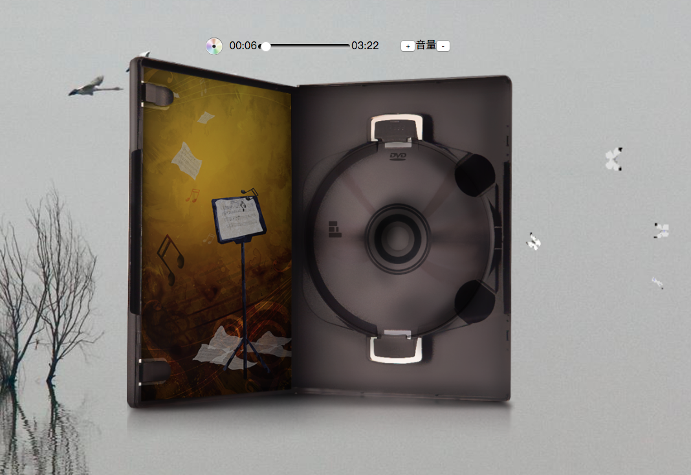
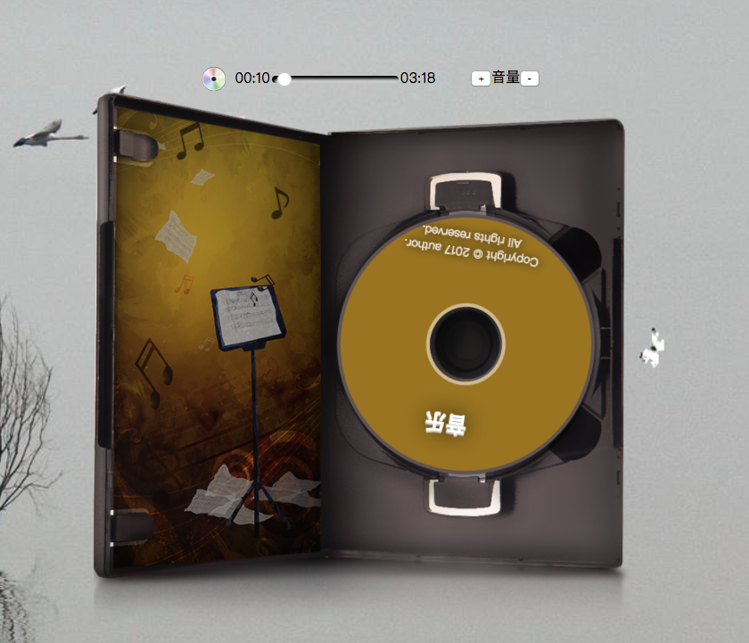
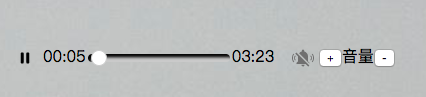

# 功能介绍：

### 效果截图：
 
*暂定播放时不放置CD效果图* 
***
 
*播放时放置CD效果图，伴有音符动画效果* 
暂停和播放通过点击[cd]图标进行切换 
 
*选择非CD模拟模式时效果图* 
## 特点：
- 统一H5 audio标签在不同浏览器中的表现；
- 使用插件时可选择使用模拟光盘效果或者只使用进度条模式；
- 插件具有良好的可移植性，使用时引入js和css和必要的images，在您的代码中只需要添加一句‘Album.init($("media"))’；
- 本插件依赖jQuery，请在引入文件的前面引入jQuery文件；
- 本插件依赖audio标签，请确认您在使用时html中有一个div类型为media并包裹了一个放置了您的音乐的audio元素;
- media中设置参数放置在data-setting属性中，可设置项目前包括是否在页面加载时候就加载音乐(”preload“选项为"true"/"false")默认true,是否需要循环播放(添加"loop"为循环，不循环就不添加此属性)默认不循环,加载页面自动播放("autoplay"选项为"true"/"false")默认true,模拟模式("CDpattern"选项为"true"/"false")默认true；
- 具体使用方法请在下载之后参见demo.html；
- media包裹层为用户自定义div请根据您需要的大小设置尺寸，如有必要可以进入musicAlbum.css调整具体元素尺寸与位置以更好适应您的页面布局。

***
